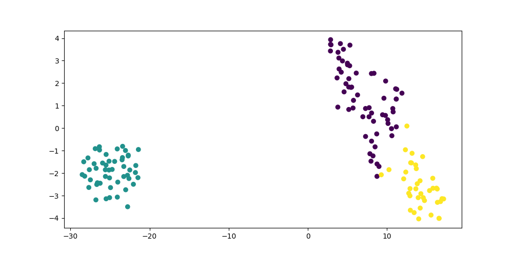

# Sprawozdanie
**Numer indeksu:** 119097
**Grupa:** B

## Krótka analiza danych
Zbiór Iris zawiera 150 rekordów trzech gatunków kwiatów:
**setosa**
**versicolor**
**virginica**

Każdy rekord opisana jest przez 4 cechy:
**sepal length**
**sepal width**
**petal length**
**petal width**

## Wyniki K-Means
Algorytm K-Means został uruchomiony z parametrem `n_clusters=3`.

Uzyskane metryki po zmapowaniu klastrów do oryginalnych etykiet:
**Accuracy:** 0.89
**Precision:** 0.91
**Recall:** 0.89
**F1-score:** 0.89

## Wizualizacja T-SNE
Poniższy obraz przedstawia wyniki w postaci wykresu 2D:
