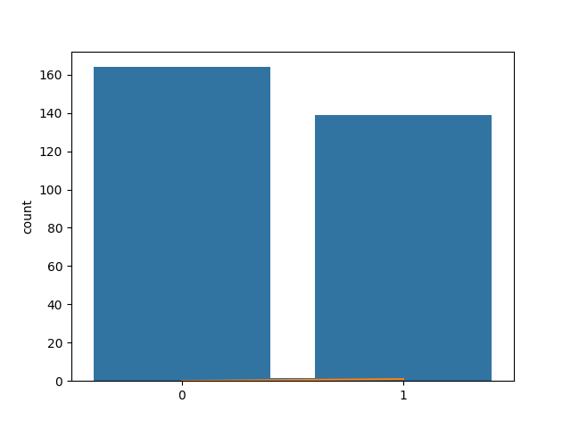
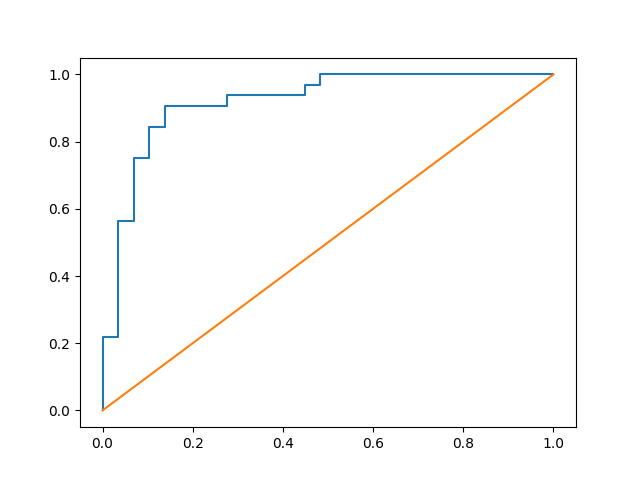

# Sprawozdanie - Zadanie 2
**Numer indeksu:** 119097
**Grupa:** B (Regresja Logistyczna)

## Analiza zbioru danych (Heart Disease)
- **Liczebność:** Zbiór zawiera 303 rekordy.
- **Brakujące dane:** Wykryto braki w cechach `ca` - 4 oraz `thal` - 2. Zostały one uzupełnione średnią wartością kolumny.
- **Rozkład zmiennych:** Cecha celu została przekształcona na binarną (0 - brak choroby, 1 - choroba). Rozkład klas jest stosunkowo równomierny (z lekką przewagą klasy 0)

## Opis algorytmu i parametrów
**Regresja Logistyczna** to model klasyfikacji, który wylicza prawdopodobieństwo przynależności do danej klasy za pomocą funkcji sigmoidalnej.

- **Parametr c:** To odwrotność siły regularyzacji. Mniejsze wartości c oznaczają silniejszą regularyzację, a duże c pozwala modelowi mocniej dopasować się do danych treningowych.

## Wykonane eksperymenty
Badano wpływ parametru `c` na dokładność klasyfikacji:
- **c = 0.01:** accuracy = 0.8361
- **c = 1.0:** accuracy = 0.8852
- **c = 100.0:** accuracy = 0.8852

Wnioski: Zwiększenie c z 0.01 do 1.0 poprawiło wynik, natomiast dalsze zwiększanie do 100.0 nie przyniosło zmian.

## Metryki modelu (dla c=1.0)
- **accuracy:** 0.89
- **precision:** 0.88
- **recall:** 0.91
- **f1-score:** 0.89

## Wizualizacje
### Rozkład zmiennych

### Krzywa ROC
Krzywa ROC ukazuje zdolność modelu do rozróżniania klas. Pole bliskie 1.0 świadczy o dobrej jakości modelu.
